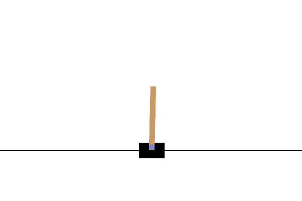
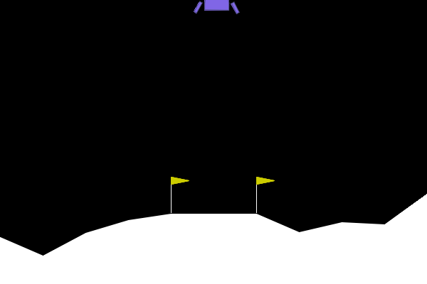
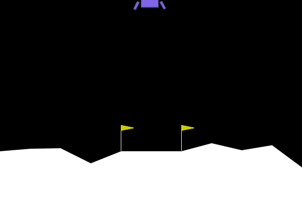
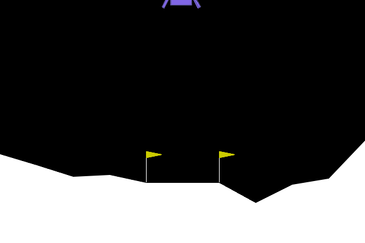
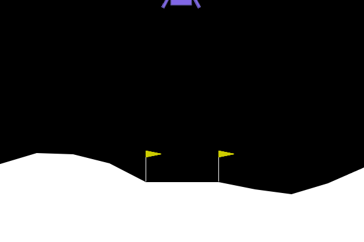
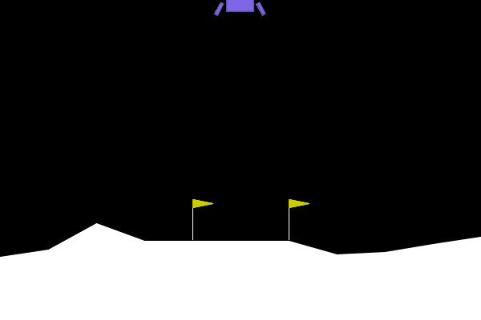
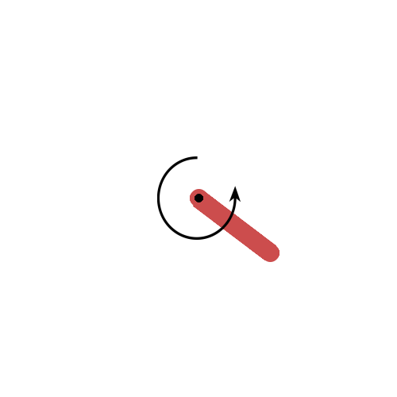
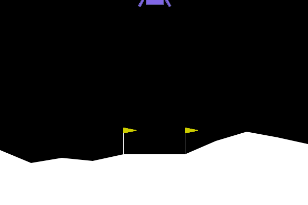
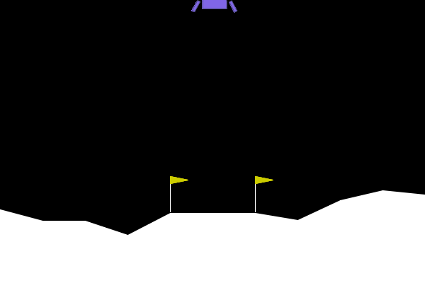

# Naive Implementations of Deep Reinforcement Learning

[](https://github.com/pre-commit/pre-commit)

## About

This is some naive implementations of deep reinforcement learning algorithms. The purpose of this repo is to help me understand the algorithms and the code. The code is not optimized for performance. If you want to use the code for your research, please refer to the original paper and the official implementation. I verify the code with [OpenAI gymnasium](https://github.com/Farama-Foundation/Gymnasiu). The most of games that I used is `LunarLander-v2`, `CartPole-v1` and `Pendulum-v1`

<!-- ## Enviornment Preparation

- common lib

  ```bash
  conda install jupyter pandas colorama pylint yapf seaborn scipy scikit-learn tqdm tensorboardx==2.5.* tensorboard==2.* pillow -y -c conda-forge
  ```

- gymnasium
  - install gymnasium

    ```bash
    conda install gymnasium pyglet pygame gymnasium-box2d -c conda-forge
    ```

- gymnasium + pytorch

  ```bash
  conda install pytorch torchvision torchaudio -c pytorch
  ```

- gymnasium + TF2

  ```bash
  conda install tensorflow -c conda-forge
  ```

- gymnasium + jax

  ```bash
  conda install jax chex optax dm-haiku jaxlib Jraph -c conda-forge
  pip install coax
  ``` -->

## Table of Contents

- [Naive Implementations of Deep Reinforcement Learning](#naive-implementations-of-deep-reinforcement-learning)
  - [About](#about)
  - [Table of Contents](#table-of-contents)
  - [Environment Preparation (torch users)](#environment-preparation-torch-users)
  - [Run](#run)
  - [Algorithms](#algorithms)
    - [Improved with Gumbel Distribution Regression from XQL](#improved-with-gumbel-distribution-regression-from-xql)
  - [Reference](#reference)

## Environment Preparation (torch users)

```bash
conda create -n rltorch pytorch torchvision torchaudio pytorch-cuda=12.1 gymnasium pyglet pygame gymnasium-box2d colorama pylint yapf tqdm 'tensorboardx>=2.5.0' 'tensorboard>2.0' pillow matplotlib scipy seaborn ipykernel -c conda-forge -c pytorch -c nvidia
```

## Run

This project does not provide the trained Deep Reinforcement Learning model weight.

You can start training model under conda environment by

```bash
(rltorch) > python -m <project name>.main
```

For example (DDPG):

```bash
(rltorch) > python -m DDPG.main
```

## Algorithms

<table border="0">
  <tbody>
    <tr align="center" >
      <td>
         
        <br>
        <p><a href="https://www.cs.toronto.edu/~vmnih/docs/dqn.pdf">DQN</a></p>
      </td>
      <td>
         
        <br>
        <p><a href="https://arxiv.org/pdf/1509.06461.pdf">DDQN</a></p>
      </td>
      <td>
         
        <br>
        <p><a href="https://arxiv.org/pdf/1509.02971.pdf">DDPG</a></p>
      </td>
    </tr>
    <tr align="center" >
      <td>
         
        <br>
        <p><a href="https://arxiv.org/pdf/1707.06347.pdf">PPO</a></p>
      </td>
      <td>
         
        <br>
        <p><a href="https://proceedings.mlr.press/v139/cobbe21a/cobbe21a.pdf">PPG</a></p>
      </td>
      <td>
         
        <br>
        <p><a href="https://arxiv.org/pdf/1707.06887.pdf">C51</a></p>
      </td>
    </tr>
    <tr align="center" >
      <td>
         
        <br>
        <p><a href="https://openreview.net/attachment?id=H1gdF34FvS">AWR</a></p>
      </td>
      <td>
         
        <br>
        <p><a href="https://proceedings.neurips.cc/paper/1999/file">AC</a></p>
      </td>
      <td>
         
        <br>
        <p><a href="https://arxiv.org/pdf/1802.09477.pdf">TD3</a></p>
      </td>
    </tr>
    <tr align="center" >
      <td>
         
        <br>
        <p><a href="https://arxiv.org/pdf/1801.01290.pdf">SACv1</a></p>
      </td>
      <td>
         
        <br>
        <p><a href="https://arxiv.org/pdf/1812.05905.pdf">SACv2</a></p>
      </td>
    </tr>
  </tbody>
</table>

### Improved with Gumbel Distribution Regression from [XQL](https://div99.github.io/XQL)

<table border="0">
  <tbody>
    <tr align="center" >
      <td>
         
        <br>
        <p>XAWR</a></p>
      </td>
      <td>
         
        <br>
        <p>XDDPG</a></p>
      </td>
    </tr>
    <tr align="center" >
      <td>
         
        <br>
        <p>XTD3</a></p>
      </td>
      <td>
         
        <br>
        <p>XSAC</a></p>
      </td>
    </tr>
  </tbody>
</table>

## Reference

- TrainMonitor and Generategif modified from [coax](https://github.com/coax-dev/coax)
- https://www.cs.toronto.edu/~vmnih/docs/dqn.pdf
- https://arxiv.org/pdf/1509.06461.pdf
- https://arxiv.org/pdf/1509.02971.pdf
- https://arxiv.org/pdf/1707.06347.pdf
- https://arxiv.org/pdf/1707.06887.pdf
- https://openreview.net/attachment?id=H1gdF34FvS&name=original_pdf
- https://proceedings.neurips.cc/paper/1999/file/6449f44a102fde848669bdd9eb6b76fa-Paper.pdf
- https://div99.github.io/XQL/
